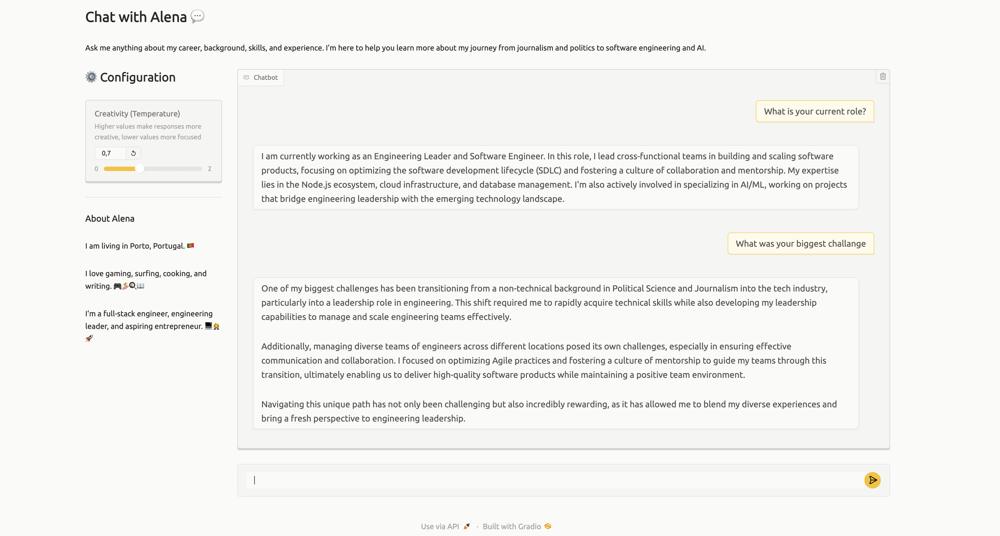

# Resume Chatbot



An AI-powered chatbot built with Gradio and OpenAI that answers questions about Alena Bukilic Dragicevic's career, background, skills, and experience. The chatbot uses GPT-4o-mini to provide personalized responses based on her CV and professional summary.

## Features

- **Interactive Chat Interface**: Chat with an AI assistant that represents Alena's professional profile
- **Career Information**: Get answers about experience, skills, projects, and background
- **CV-Based Responses**: All answers are grounded in the actual CV and summary documents
- **Contact Collection**: The chatbot can collect visitor contact information (name, email, notes)
- **Question Tracking**: Records questions that couldn't be answered for follow-up
- **Pushover Notifications**: Sends notifications when users provide contact details or ask unanswerable questions

## Setup

### Prerequisites

- Python 3.8 or higher
- OpenAI API key
- Pushover account (for notifications - optional but recommended)

### Installation

1. Create a virtual environment:
   ```bash
   python3 -m venv venv
   source venv/bin/activate  # On Windows: venv\Scripts\activate
   ```

   Or using `uv`:
   ```bash
   uv venv
   source .venv/bin/activate
   ```

2. Install dependencies:
   ```bash
   pip install -r requirements.txt
   ```
   
   Or using `uv`:
   ```bash
   uv pip install -r requirements.txt
   ```

3. Set up environment variables:
   
   Create a `.env` file in the project root with the following:
   ```env
   OPENAI_API_KEY=your_openai_api_key_here
   PUSHOVER_TOKEN=your_pushover_token_here
   PUSHOVER_USER=your_pushover_user_here
   ```

4. Ensure required files exist:
   - `me/cv.pdf` - Your CV in PDF format
   - `me/summary.txt` - A summary of your background

### Running the App

```bash
python app.py
```

Or using `uv`:
```bash
uv run python app.py
```

The app will be available at `http://127.0.0.1:7860`

## How It Works

The chatbot uses OpenAI's GPT-4o-mini model with function calling capabilities to:
1. Answer questions based on the CV and summary documents
2. Collect visitor contact information when users express interest
3. Track questions that couldn't be answered for improvement
4. Send notifications via Pushover when important events occur

The AI is instructed to represent Alena professionally, highlighting her unique transition from politics to engineering leadership, and to encourage meaningful connections with potential clients or employers.

## Project Structure

```
resume-chatbot/
├── app.py              # Main application file
├── requirements.txt    # Python dependencies
├── .env                # Environment variables (not in git)
├── images/
│   ├── screenshot.png # Application screenshot
├── me/
│   ├── cv.pdf         # CV document
│   └── summary.txt    # Professional summary
└── README.md          # This file
```
